<!--
  ===================================================================
  SYEDA QURRATH UL AIN — GITHUB PROFILE README
  ===================================================================
  Every URL in this file has been verified. No placeholders, no
  broken links, no deprecated services.
  
  Widgets powered by:
    - capsule-render.vercel.app    (header/footer banners)
    - readme-typing-svg.demolab.com (typing animation)
    - img.shields.io               (badges)
    - skillicons.dev               (tech stack icons)
    - github-readme-stats          (stats + top langs)
    - streak-stats.demolab.com     (streak stats)
    - github-readme-activity-graph (activity graph)
    - github-profile-trophy        (trophies)
    - komarev.com                  (visitor counter)
    - quotes-github-readme         (dev quotes)
  
  GitHub Actions generated:
    - Snake animation  → output branch (snake.yml)
    - Metrics SVG      → assets/images/metrics.svg (metrics.yml)
  ===================================================================
-->

<!-- ======================== HEADER BANNER ======================== -->
<p align="center">
  
</p>

<!-- ======================== TYPING ANIMATION ======================== -->
<p align="center">
  <a href="https://github.com/syedaqurrath">
    
  </a>
</p>

<!-- ======================== SOCIAL BADGES ======================== -->
<p align="center">
  <a href="https://linkedin.com/in/syeda-qurrath282">
    
  </a>
  <a href="https://github.com/syedaqurrath">
    
  </a>
  <a href="mailto:qurrath2809@gmail.com">
    
  </a>
</p>

<p align="center">
  
</p>

<br/>

<!-- ======================== TABLE OF CONTENTS ======================== -->
<details>
<summary><b>📑 Table of Contents</b></summary>

- [About Me](#-about-me)
- [Currently Learning](#-currently-learning)
- [Tech Stack](#️-tech-stack)
- [Skill Proficiency](#-skill-proficiency)
- [Experience](#-experience)
- [Featured Projects](#-featured-projects)
- [Open Source](#-open-source)
- [Certifications](#-certifications)
- [GitHub Analytics](#-github-analytics)
- [Achievements](#-achievements)
- [2026 Roadmap](#️-2026-roadmap)
- [Fun Facts](#-fun-facts)
- [Let's Connect](#-lets-connect)

</details>

<br/>

<!-- ======================== ABOUT ME ======================== -->
## 👩‍💻 About Me

```yaml
name: "Syeda Qurrath Ul Ain"
role: "Software Engineer — AI & Full-Stack Development"
location: "Bengaluru, Karnataka, India"
education: "MCA, Presidency University (GPA 8.8/10, Distinction)"
focus_areas:
  - Full-Stack Development (MERN)
  - AI-integrated applications & Computer Vision
  - REST API design & secure authentication
open_to:
  - "Software Engineering roles"
  - "AI/ML Engineering roles"
  - "Remote & Bengaluru-based opportunities"
open_source: true
currently_learning:
  - "Deep Learning"
  - "Transformers"
  - "LLMs"
  - "RAG"
  - "LangChain"
  - "AWS"
  - "System Design"
```

I'm an MCA graduate who builds production-quality software across **Python, Node.js, React.js, and OpenCV** stacks — spanning RESTful API design, secure authentication systems, real-time interactivity, and ML data pipelines. I hold the **Oracle Certified AI Foundations Associate** certification and I'm an active **GSSoC (GirlScript Summer of Code)** open-source contributor.

I care about clean architecture, readable code, and shipping things that actually work end-to-end — not just in a notebook.

<br/>

<!-- ======================== CURRENTLY LEARNING ======================== -->
## 🌱 Currently Learning

<table align="center">
  <tr>
    <td align="center" width="150">
      <br/>
      <b>Deep Learning</b>
    </td>
    <td align="center" width="150">
      <br/>
      <b>Transformers</b>
    </td>
    <td align="center" width="150">
      <br/>
      <b>LLMs</b>
    </td>
    <td align="center" width="150">
      <br/>
      <b>RAG</b>
    </td>
  </tr>
  <tr>
    <td align="center" width="150">
      <br/>
      <b>LangChain</b>
    </td>
    <td align="center" width="150">
      <br/>
      <b>AWS</b>
    </td>
    <td align="center" width="150">
      <br/>
      <b>Docker</b>
    </td>
    <td align="center" width="150">
      <br/>
      <b>System Design</b>
    </td>
  </tr>
  <tr>
    <td align="center" colspan="4">
      <br/>
      <b>Data Structures &amp; Algorithms</b>
    </td>
  </tr>
</table>

<br/>

<!-- ======================== TECH STACK ======================== -->
## 🛠️ Tech Stack

<details open>
<summary><b>Languages</b></summary>
<br/>
<p align="center">
  
</p>
</details>

<details open>
<summary><b>Frontend</b></summary>
<br/>
<p align="center">
  
</p>
</details>

<details open>
<summary><b>Backend</b></summary>
<br/>
<p align="center">
  
</p>

- RESTful API Design · JWT · bcrypt · OAuth 2.0 · Passport.js · Session Management · Middleware
</details>

<details open>
<summary><b>Databases</b></summary>
<br/>
<p align="center">
  
</p>
</details>

<details open>
<summary><b>AI / Machine Learning / Computer Vision</b></summary>
<br/>

- OpenCV · MediaPipe · Computer Vision · Machine Learning · Feature Engineering · Data Preprocessing · Data Analysis (Pandas, NumPy)
</details>

<details open>
<summary><b>Cloud & DevOps</b></summary>
<br/>
<p align="center">
  
</p>

- Docker (Fundamentals) · Netlify Deployment
</details>

<details open>
<summary><b>Testing & QA</b></summary>
<br/>

- API Testing (Postman — certified) · Functional Testing · Debugging · Test Documentation
</details>

<details open>
<summary><b>Tools & Practices</b></summary>
<br/>
<p align="center">
  
</p>

- Agile · SDLC · OOP · DBMS · Version Control
</details>

<br/>

<!-- ======================== SKILL PROFICIENCY ======================== -->
## 📈 Skill Proficiency

| Skill | Proficiency |
|---|---|
| Python | ████████████████░░░░ 80% |
| JavaScript | ███████████████░░░░░ 75% |
| React.js / Node.js / Express.js | ███████████████░░░░░ 75% |
| SQL (MySQL / MongoDB) | ██████████████░░░░░░ 70% |
| REST API Design & Authentication | ████████████████░░░░ 80% |
| Computer Vision (OpenCV / MediaPipe) | █████████████░░░░░░░ 65% |
| Git / GitHub Workflows | ████████████████░░░░ 80% |
| Deep Learning / LLMs / RAG | ████████░░░░░░░░░░░░ 40% *(actively learning)* |

<br/>

<!-- ======================== EXPERIENCE ======================== -->
## 💼 Experience

<table>
  <tr>
    <td width="90" align="center">🧠</td>
    <td>
      <b>AI and Data Science Intern</b> — Ozenfx, Bengaluru <br/>
      <sub><i>Feb 2026 – May 2026</i></sub>
      <ul>
        <li>Engineered end-to-end data preprocessing and feature-engineering pipelines in Python (Pandas, NumPy) for ML model evaluation across 3+ structured business datasets.</li>
        <li>Conducted exploratory data analysis, producing visualizations that informed model selection decisions made with the senior data science team.</li>
        <li>Implemented train/test splits, k-fold cross-validation, and performance-metric evaluation across 2+ ML models.</li>
      </ul>
    </td>
  </tr>
  <tr>
    <td width="90" align="center">🌐</td>
    <td>
      <b>Open Source Contributor</b> — GirlScript Summer of Code (GSSoC) <br/>
      <sub><i>Oct 2025 – Dec 2025</i></sub>
      <ul>
        <li>Resolved 10+ React.js frontend defects across 3 high-traffic open-source repositories.</li>
        <li>Practiced Git workflows — feature branching, rebasing, code review, and pull requests — in Agile distributed teams.</li>
        <li>🏆 Awarded <b>GSSoC 2025 Contributor Recognition</b> for sustained quality.</li>
      </ul>
    </td>
  </tr>
  <tr>
    <td width="90" align="center">🎓</td>
    <td>
      <b>Master of Computer Applications (MCA)</b> — Presidency University, Bengaluru <br/>
      <sub><i>Dec 2024 – May 2026 · GPA 8.8/10 · Graduated with Distinction</i></sub>
    </td>
  </tr>
  <tr>
    <td width="90" align="center">🎓</td>
    <td>
      <b>Bachelor of Computer Applications (BCA)</b> — Pssshe, Davangere <br/>
      <sub><i>Nov 2021 – Jul 2024 · GPA 8.9/10 · Graduated with Distinction</i></sub>
    </td>
  </tr>
</table>

<br/>

<!-- ======================== FEATURED PROJECTS ======================== -->
## 🚀 Featured Projects

<table>
<tr>
<td width="50%" valign="top">

### 🔐 Multi-Factor Authentication System


Production-grade MERN authentication system implementing JWT, bcrypt hashing (10+ salt rounds), OAuth 2.0 (Google & GitHub), and TOTP-based MFA — protecting 4 distinct user flows in alignment with OWASP Top 10 standards.

**Key Features**
- 8+ documented REST API endpoints (registration, login, verification, password reset, session management)
- React dashboard with protected routing and real-time feedback
- OWASP-aligned security practices

**Tech Stack**
`Node.js` `Express.js` `MongoDB` `Passport.js` `React.js`

</td>
<td width="50%" valign="top">

### 🖐️ Hand Gesture Recognition System


Real-time computer-vision inference pipeline classifying 10+ distinct hand gestures from live camera streams with under 50ms end-to-end latency, enabling touchless desktop interaction for 5 mapped system actions.

**Key Features**
- Modular gesture-to-action mapping architecture
- Recognition logic decoupled from interaction logic
- ~70% reduction in extension effort for new gesture commands

**Tech Stack**
`Python` `OpenCV` `MediaPipe`

</td>
</tr>
<tr>
<td width="50%" valign="top">

### 📚 PrepAI — AI-Assisted Learning Platform


Full-stack MERN learning platform with 6+ modular REST APIs, JWT role-based access control, and a MongoDB schema supporting 3 user roles — learner, contributor, and admin — with personalized content delivery.

**Key Features**
- AI-assisted content recommendation integrated via a clean API layer
- Role-based access control across 3 distinct user types
- ~40% reduction in manual content-selection effort

**Tech Stack**
`React.js` `Node.js` `Express.js` `MongoDB`

</td>
<td width="50%" valign="top">

### 🗺️ Tourist Assistance Platform


Location-aware SPA handling 20+ tourist query types with real-time map rendering via React-Leaflet, Supabase-backed authentication, and cloud data services — sub-2-second load times on standard connections.

**Key Features**
- Web Speech API voice-recognition layer for hands-free navigation
- Real-time map rendering with React-Leaflet
- Third input modality alongside touch and click

**Tech Stack**
`React.js` `Supabase` `React-Leaflet` `Web Speech API`

</td>
</tr>
</table>

<br/>

<!-- ======================== OPEN SOURCE ======================== -->
## 🌐 Open Source

<p align="center">
  
  
</p>

As a **GSSoC 2025** contributor, I resolved 10+ frontend defects across 3 high-traffic open-source repositories and practiced professional Git workflows daily:

- 🌿 Feature branching & rebasing
- 🔍 Code reviews
- 🔀 Pull requests within Agile, distributed teams
- 🤝 Cross-timezone collaboration across a 2-month program

<br/>

<!-- ======================== CERTIFICATIONS ======================== -->
## 📜 Certifications

<table align="center">
  <tr>
    <td align="center" width="260">
      <br/>
      <b>Oracle Certified AI Foundations Associate</b><br/>
      <sub>Cloud Infrastructure & AI/ML Fundamentals</sub>
    </td>
    <td align="center" width="260">
      <br/>
      <b>Postman API Fundamentals Student Expert</b><br/>
      <sub>Advanced API Testing & Documentation</sub>
    </td>
    <td align="center" width="260">
      <br/>
      <b>GSSoC 2025 Contributor Recognition</b><br/>
      <sub>Consistent High-Quality Open-Source Contributions</sub>
    </td>
  </tr>
</table>

<br/>

<!-- ======================== GITHUB ANALYTICS ======================== -->
## 📊 GitHub Analytics

<!--
  Widgets 1–4 + Trophies are hosted services — zero setup, just push.
  Snake animation requires snake.yml workflow (output branch).
  Metrics SVG requires metrics.yml workflow (commits to main).
-->

<p align="center">
  
  
</p>

<p align="center">
  
</p>

<p align="center">
  
</p>

<!-- GitHub Metrics — generated by .github/workflows/metrics.yml, committed to main branch -->
<p align="center">
  
</p>

<!-- Snake animation — generated by .github/workflows/snake.yml, pushed to output branch -->
<p align="center">
  
</p>

<p align="center">
  
</p>

<br/>

<!-- ======================== ACHIEVEMENTS ======================== -->
## 🏆 Achievements

<table align="center">
  <tr>
    <td align="center" width="150"><h3>4+</h3>Projects Built</td>
    <td align="center" width="150"><h3>1</h3>Internship</td>
    <td align="center" width="150"><h3>10+</h3>OSS Bugs Fixed</td>
    <td align="center" width="150"><h3>1</h3>AI Certification</td>
  </tr>
</table>

<br/>

<!-- ======================== 2026 ROADMAP ======================== -->
## 🗺️ 2026 Roadmap

- [ ] Build and ship a production-grade AI SaaS product
- [ ] Contribute to a major open-source project (framework/library level)
- [ ] Master AWS (core services + deployment pipelines)
- [ ] Go deep on Deep Learning & Transformer architectures
- [ ] Publish a technical write-up / research note
- [ ] Strengthen System Design fundamentals

<br/>

<!-- ======================== FUN FACTS ======================== -->
## ⚡ Fun Facts

- 🧩 I enjoy solving real-world problems more than toy problems
- 🤖 I love building AI-powered products end-to-end, from model to UI
- 🏗️ I care deeply about clean, modular architecture
- 🌙 Best debugging happens after midnight, with good music

<br/>

<!-- ======================== LET'S CONNECT ======================== -->
## 💬 Let's Connect

<p align="center">
  I'm always happy to talk about AI engineering, full-stack architecture, or open source.
  Reach out on <a href="https://linkedin.com/in/syeda-qurrath282">LinkedIn</a> or drop a line at
  <a href="mailto:qurrath2809@gmail.com">qurrath2809@gmail.com</a>.
</p>

<br/>

<!-- ======================== DEV QUOTE ======================== -->
<p align="center">
  
</p>

<br/>

<!-- ======================== FOOTER ======================== -->
<p align="center">
  
</p>

<p align="center">
  <sub>Thanks for stopping by — let's build something great together. 🚀</sub>
</p>
